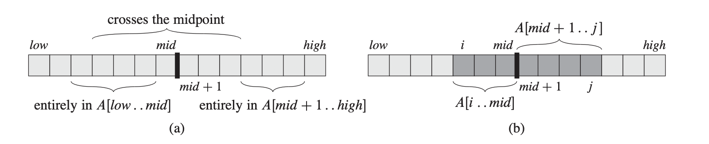

# Maximum Subarray
Given an array A, the maximum subarray problem requires us to find a non-empty, contiguous subarray of A whose value has the largest sum. Array A contains negative values. There can be multiple maximum subarrays.

`A = [1,2,-3,4,-1,2,-7,5]`

The above array `A` has the following maximum subarrays.

`[1,2,-3,4,-1,2] = 5, [4,-1,2] = 5, [5] = 5`

For simplicity, we only need to find any of the valid maximum subarray. The method `MaxSubArray` will return the following values `(start index, end index, array sum)`.

## Naive Solution
We can iterate through every single possible subarray and record the maximum. Brute forcing through the array will have a $\Theta(n^2)$ time complexity.

## Divide and Conquer 
We can solve the problem with divide and conquer techniques. When we are finding the maximum subarray of `A[low...high]`, we have to first divide the array into two subarrays of **as equal size as possible** (divide step). This can be done when we repeatedly partition the array using the **midpoint** of the array.

`A[low..mid..high] -> A1[low..mid], A2[mid+1..high]`

Now, we know that the maximum subarray `A[i..j]` must lie in exactly one of the following places

- Entirely in the left subarray
- Entirely in the right subarray
- crossing the midpoint, such that $low \leq i \leq mid \leq j \leq high$.

As the figure suggests, to find the maximum subarray which crosses the midpoint, we just need to find the maximum subarray of the form `A[i..mid]` and `A[mid..j]` and combine them, along with the sum of the values in the maximum subarray.

## Linear Solution
Kadane's algorithm solves the problem in linear time. It keeps a copy of the existing sum and a max sum. As it encounters a new element in the array, it will calculate the new current sum, where `currentSum = currentSum + Array[i]`. Here, if `Array[i] > currentSum`, it means the `currentSum` is negative and can be safely discarded. Then, if `currentSum > maxSum`, we will replace `maxSum` with the new maximum value.

## Implementation
`max_array.go` defines a `go` array struct which implements the `MaxSubArray` method.

`max_array_test.go` contains the tests for `MaxSubArray` method.

The `MaxSubArray` method contains an optional parameter `mode`. This `mode` determines to run the brute-force, divice-and-conquer, or linear solution.

Run test cases with `go test . -v` under this directory. `-v` flag shows the printed outputs.